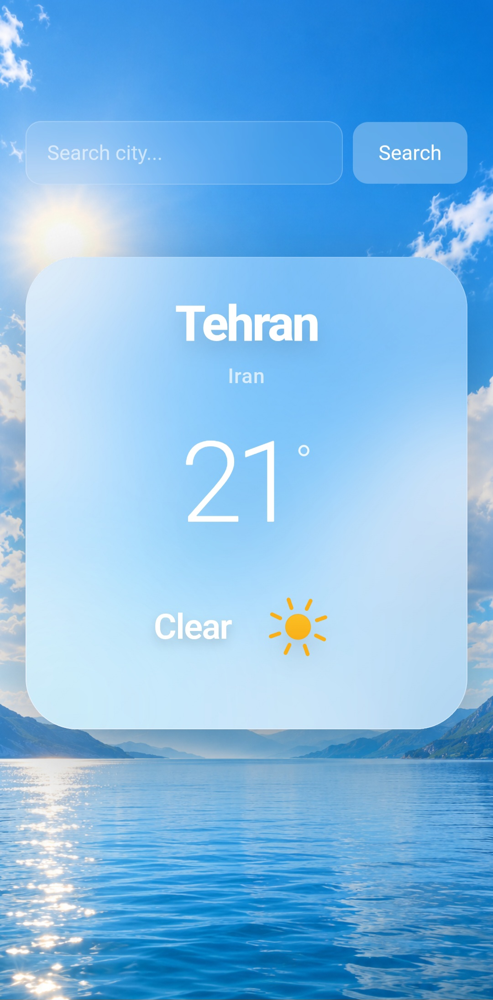

# 🌤️ Weather Website

A modern, responsive weather application built with **React**, **JavaScript**, and **Tailwind CSS**.

This project fetches real-time weather data using the **Open-Meteo API**, supports city search, and features dynamic backgrounds and weather-specific icons with a clean glassmorphism-inspired UI.

<br>

## 📸 Screenshot



<br>

## ✨ Features

- 🔎 Search weather by city name
- 🌡️ Display current temperature
- 🌤️ Show current weather condition
- 🌍 Display city and country
- 🎨 Dynamic background based on weather condition
- ☁️ Weather-specific icons
- ⏳ Animated loading screen
- 🧊 Glassmorphism / iOS-inspired interface
- 📱 Mobile-first responsive design
- ⚡ Real-time data from Open-Meteo (no API key required)
- 🧩 Clean separation of UI components, services, and utilities

<br>

## 🛠️ Tech Stack

| Technology       | Description                          |
|------------------|--------------------------------------|
| **React**        | UI library                           |
| **JavaScript**   | Programming language                 |
| **Tailwind CSS** | Utility-first CSS framework          |
| **Vite**         | Build tool & development server      |
| **Open-Meteo**   | Weather & Geocoding API              |
| **Meteocons**    | Weather icons                        |

<br>

## 🏗️ Architecture

```
App
 └── WeatherContent
      ├── SearchBar
      ├── Loading
      └── WeatherCard
```

### Components

| File                  | Responsibility                              |
|-----------------------|---------------------------------------------|
| `SearchBar.jsx`       | City search input and form submission       |
| `WeatherCard.jsx`     | Displays current weather information        |
| `WeatherContent.jsx`  | Manages weather state and application flow  |
| `Loading.jsx`         | Weather loading animation                   |

### Services

| File                   | Responsibility                              |
|------------------------|---------------------------------------------|
| `geocodingService.js`  | Converts city name → latitude & longitude   |
| `weatherService.js`    | Fetches current weather data                |

### Utils

| File                   | Responsibility                              |
|------------------------|---------------------------------------------|
| `weatherConditions.js` | Maps Open-Meteo weather codes to conditions |

<br>

## 📁 Project Structure

```text
Weather-website/
│
├── public/
│   └── screenshot/
│       └── screenshot.jpg
│
├── src/
│   ├── components/
│   │   ├── SearchBar.jsx
│   │   ├── WeatherCard.jsx
│   │   ├── WeatherContent.jsx
│   │   └── Loading.jsx
│   │
│   ├── services/
│   │   ├── geocodingService.js
│   │   └── weatherService.js
│   │
│   ├── utils/
│   │   └── weatherConditions.js
│   │
│   ├── assets/
│   │   └── images/
│   │       ├── clear.png
│   │       ├── cloudy.png
│   │       ├── rainy.png
│   │       ├── snowy.png
│   │       ├── stormy.png
│   │       └── windy.png
│   │
│   ├── App.jsx
│   └── main.jsx
│
├── package.json
├── vite.config.js
└── README.md
```

<br>

## 🔄 Data Flow

```text
User enters city name
        ↓
    SearchBar
        ↓
   searchCity()
        ↓
Latitude + Longitude
        ↓
   getWeather()
        ↓
Temperature + Weather Code
        ↓
getWeatherCondition()
        ↓
  Weather Condition
        ↓
   WeatherCard
```

> The application loads **Tehran** weather by default on startup.

<br>

## 🌐 APIs

### Open-Meteo Geocoding API

Converts a city name into geographic coordinates.

```
https://geocoding-api.open-meteo.com/v1/search
```

### Open-Meteo Weather API

Retrieves current weather data for given coordinates.

```
https://api.open-meteo.com/v1/forecast
```

> **Note:** No API key is required.

<br>

## 🎨 UI & Design

The interface follows a modern **glassmorphism** style with:

- Transparent glass surfaces
- Background blur effects
- Soft shadows
- Rounded corners
- Dynamic weather-based backgrounds
- Weather-specific icons
- Clear and large typography
- Mobile-first responsive layout

The main background automatically changes according to the current weather condition.

<br>

## ⚙️ Installation & Setup

### 1. Clone the repository

```bash
git clone https://github.com/AmirMohammadNazemiDev/Weather-website.git
```

### 2. Navigate to the project folder

```bash
cd Weather-website
```

### 3. Install dependencies

```bash
npm install
```

### 4. Start the development server

```bash
npm run dev
```

The app will be available at the local URL provided by Vite (usually `http://localhost:5173`).

<br>

## 📦 Production Build

### Build for production

```bash
npm run build
```

### Preview the production build

```bash
npm run preview
```

<br>

## 🔮 Future Improvements

- [ ] Multi-day weather forecast
- [ ] Celsius / Fahrenheit unit switching
- [ ] Wind speed and direction
- [ ] Humidity information
- [ ] Sunrise & sunset times
- [ ] User geolocation support
- [ ] City search suggestions / autocomplete
- [ ] Day / night weather states
- [ ] Better internationalization (i18n)

<br>

## 📄 License

This project was created for **learning** and **portfolio** purposes.

Feel free to use it, modify it, or take inspiration from it.

<br>

---

<div align="center">

**Made with ❤️ by [AmirMohammadNazemiDev](https://github.com/AmirMohammadNazemiDev)**

</div>
